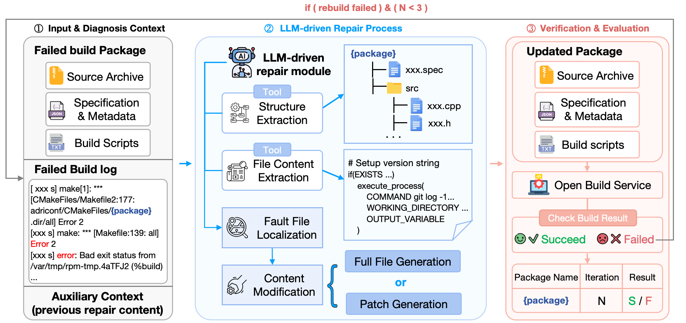

# 🧩 Build-bench: LLM-driven Cross-ISA Build Repair Framework

This repository implements the **Build-bench** framework — an end-to-end evaluation pipeline for large language models (LLMs) to repair software build failures across instruction set architectures (ISA), such as **x86_64 → aarch64** and **aarch64 → x86_64**.

The system enables **autonomous reasoning**, **tool-augmented repair**, and **executable verification** through iterative interactions based on the Model Context Protocol (MCP).
An interactive visualization of all model results (success/failure cases, tool calls, repair iterations) is available at:  
👉 **[https://buildbench-hub.github.io/buildbench.github.io](https://buildbench-hub.github.io/buildbench.github.io/)**  


---

## 🌐 Overview

<p align="center">
  
</p>

Build-bench automatically:
1. Collects failed software packages and contextual artifacts (source archives, specs, logs);
2. Guides the LLM to diagnose the failure cause;
3. Applies `Full File Generation` or `Patch Generation`;
4. Uploads the repaired package to the open build service (OBS) for validation;
5. Iteratively refines the repair based on build logs until success or reaching the iteration limit.

---

## 📂 Directory Structure

```
.
├── config/
│ └── info.yaml # Configuration file for dataset paths and model setup
│
├── data/
│ └── case_study/
│ └── x86_succeed_pro/ # Example successful build results for reference
│ └── texmath_diff.log # Diff log used for case study visualization
│
├── prompts/
│ ├── full_file_generation.txt # Prompt for Full File Generation repair strategy
│ └── patch_generation.txt # Prompt for Patch Generation repair strategy
│
├── tools/
│ └── auto_repair/
│ ├── get_repo_structure.py # Tool: Structure Extraction
│ ├── upload_files.py # Tool: Upload to Build Service
│ ├── check_build_res.py # Tool: Check Build Result (success/failure)
│
├── client.py # MCP client: executes repair loop (Full File Generation)
├── client_patch.py # MCP client: executes repair loop (Patch Generation)
├── server.py # MCP server coordinating LLM and tools (Full File Generation)
├── server_patch.py # MCP server coordinating LLM and tools (Patch Generation)
├── uv.lock # Environment lock file for reproducibility
└── pyproject.toml # Dependencies and environment configuration
```

---

## ⚙️ Installation

```bash
# Clone the repository
git clone https://github.com/zcyyc/Build-bench.git
cd Build-bench

# Recreate the virtual environment
uv sync

```

Ensure that your .env file includes the llm api key as well as api_base_url:

```bash
API_KEY="xxx"
API_BASE_URL="xxx"
```

## 🚀 Running the Framework
Full-File Generation Strategy
```bash
# Launch the client for iterative repair
python client.py
```
Patch Generation Strategy
```bash
# Launch the client for iterative repair using patch strategy
python client_patch.py
```

Each repair session will iteratively:

Extract package structure;

Retrieve failure logs;

Generate repair suggestions via LLM;

Apply modifications to source/spec files;

Upload and validate builds on OBS.


## 📊 Data and Case Study

The folder data/case_study/ provides example build results (e.g., x86→ARM full repair) used in Section 5 of the paper for qualitative analysis.

